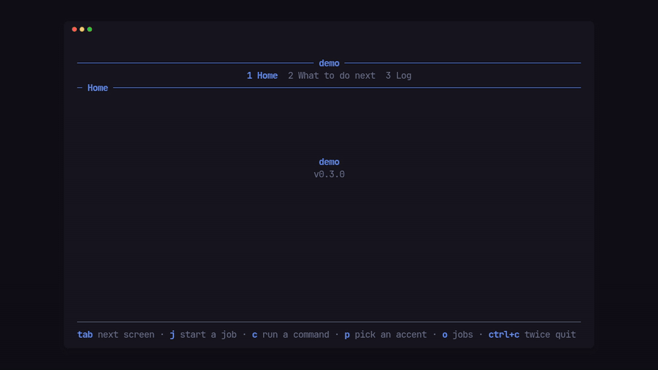

# pito-tui

[](https://github.com/gmrdad82/pito-tui/actions/workflows/ci.yml)



The app shell for [PITO](https://pitomd.com) terminal apps, as one ratatui 0.30
crate. An app gives it a name, a version and an accent colour, and plugs in its
screens; the shell does everything around them: the terminal, the loop, the
keys, the header, the footer, the hourglass while a screen loads, and headless
dumps for tests and reviews. It brings [pito-header], [pito-footer],
[pito-hourglass] and [pito-list] with it and re-exports them, so an app pins one
crate.

It has no words of its own: every label, hint and message on screen comes from
the app, in any language.

[pito-header]: https://github.com/gmrdad82/pito-header
[pito-footer]: https://github.com/gmrdad82/pito-footer
[pito-hourglass]: https://github.com/gmrdad82/pito-hourglass
[pito-list]: https://github.com/gmrdad82/pito-list

## Install

```toml
pito-tui = { git = "https://github.com/gmrdad82/pito-tui", tag = "v0.3.6" }
```

That one line brings ratatui 0.30, crossterm 0.29, pito-header v0.2.0,
pito-footer v0.4.0, pito-hourglass v0.1.3 and pito-list v0.7.0, reachable as
`pito_tui::ratatui`, `pito_tui::crossterm`, `pito_tui::header`,
`pito_tui::footer`, `pito_tui::hourglass` and `pito_tui::list`.

Run the demo to see it (`ctrl+c` twice quits):

```sh
cargo run --example demo
cargo run --example demo -- --dump 100x24 --keys "tab down enter"
```

## What it does

- **Screens, plugged in.** Each screen is a type that implements `Screen`:
  it draws its area, takes its keys, and says what it shows in the header
  (facts, a status, a breadcrumb) and the footer (hints, an input bar). The
  shell lays them out as numbered tabs in groups (pito-header), switches
  between them with the app's nav keys, and starts a screen the first time
  it is shown. A screen hears each time the nav brings it up (`entered`):
  a tab, group or digit key, the digit of the screen already shown too, a
  click on its tab, or `go`; not the first screen at start.
- **Loads that can't land late.** A screen hands the shell its read
  (`load`), the shell runs it on a worker and delivers the answer
  (`loaded`) only if it is still the newest one: each read carries a
  generation, so an answer that comes back after the user stopped waiting,
  or after a newer read, is dropped. While a screen loads, the shell shows
  the hourglass (pito-hourglass) with the screen's own words; a stop key
  (`esc` unless the app picks others) stops waiting. `Cx::changed(source)`
  marks every screen that reads that source stale, and they read again.
- **Timed work without a key.** A screen's `deadline` wakes the loop, and
  when the loop's moment reaches it the shell calls the screen's `tick`,
  once for each deadline the screen gives, whichever screen is showing: a
  poll every few seconds, a read that timed out. The same happens in
  `settle` and when `Tui::advance` moves the clock of a headless run.
- **A 120 fps paced loop that never blocks the UI thread.** An input thread
  and the app's workers wake one channel; the loop drains every wake in a
  batch, redraws only when something changed, no more often than every
  8.3 ms, and otherwise sleeps until the next wake or deadline (the quit
  notice running out, a screen's own deadline, the next frame of an
  activity's spinner). Every frame is a
  synchronized update, so the terminal never shows half of one. Idle, it
  draws nothing.
- **Keys in a fixed order:** a key release is ignored; then the quit guard
  (a double `ctrl+c`, asking first while work runs, with the app's words);
  then an open confirm, unless the key is one the app lets through
  (`through_keys`, such as `ctrl+r` for a refresh), which goes to `on_key`
  and the screen with the confirm left open; then a screen that is typing
  into an input; then the help toggle (`?`); then the keys that open an
  overlay (the activity screen or the app's own); then the nav keys (only
  the back keys while an overlay is open); then the stop key while a screen
  loads; then the app's own keys (`on_key`); then the screen. `Cx::key`
  tells a callback which key led to it, so `back` knows `esc` from `q`.
- **A terminal that is always given back.** `Term` turns on raw mode, the
  alternate screen and bracketed paste (mouse capture and focus events only
  when the app asks), remembers each one it turned on, and turns exactly
  those off again on quit, on an error, and on a panic on the UI thread,
  before the panic message prints. A panic on a worker thread leaves the
  running app alone. The app's own panic hook still runs after it, and a
  hook that ends the process calls `pito_tui::restore()` first: any thread
  may call it, the first call gives the terminal back and waits for a frame
  being drawn to finish, later calls do nothing, and the shell draws nothing
  after it.
- **A palette from one colour, or a whole one.** `Palette::new(accent)`
  derives every style the header, footer, list and hourglass draw with;
  `Palette` also takes each token by hand (base, ink, muted, accent,
  selected, good, bad, rule, line, glass, shimmer). `Cx::palette` swaps it
  while the app runs, and the hourglass follows.
- **The footer, assembled:** the screen's hints and the app's, the notice
  line, the confirm bar, the input bar, and the app's name and version at
  the right end of the row of keys (pito-footer's version slot). The notice
  line is the first that speaks of: the quit guard, what a screen said with
  `Cx::say` (gone at the next key), the screen's own `notice` (in any tone,
  for as long as the screen keeps it, such as an error until the next
  action), and the screen's `legend` while the hints show. While an input
  bar or a confirm is open, the quit guard's word takes the bar's hint row,
  in the accent, and the bar's own hint comes back when the guard lapses;
  with `lit_again(false)` it takes an input bar's hint row in the bar's own
  hint style, and a confirm keeps its own hint.
  The quit question has its own hint (`Words::leave`), falling back to the
  confirm's (`Words::choose`). `?` hides the hints; the header then shows
  the app's help word.
- **The header, assembled:** the app's name on the title rule, with the help
  word and the screen's `lead` on its left and the screen's status on its
  right, each in styled parts and each told the room it has, so a screen
  can drop a part that won't fit rather than see it cut; the groups and
  screens as tabs; the screen's facts; and its breadcrumb kept in step:
  when a screen opens something (`crumb`), the sections row becomes the
  breadcrumb, and the nav's back key (`esc`, `q`) calls the screen's
  `back`. The facts row goes while a screen is drilled in, unless the app
  keeps it (`keep_facts`), on the same row. A screen that wants the whole
  left side, the help word joined to its lead in its own style, gives it
  in `left(room, help)`: `help` is the help word when the shell would show
  it (the hints hidden), and `None` keeps the shell's join.
- **Activities.** The app hands the shell what it has running (`Cx::activity`,
  `Cx::activities`, `Cx::forget`): each with a label, a state (running,
  waiting, done, failed, stopped), a progress fraction or none (a spinner then), when
  it started and ended, a short status line and the detail lines it opens
  into (a log, its steps). The shell draws them as a band flush on the
  footer, the newest first, taking up to half the room, with a finished one
  fading for 3 s before it goes; the app turns the band on and off
  (`Cx::band`). A key the app picks opens the activity screen over any
  screen, outside the tabs: the tabs unlit, only the back keys, its own
  breadcrumb row ("Operations / update pfx"), every activity listed, and
  `enter` opening one into its detail lines. Every word on them is the
  app's (`Activities`), and the data stays the app's: the shell only draws,
  pages and takes the keys, and its time is the loop's moment.
  `Cx::activities` replaces the app's own list and leaves the commands'
  activities (below) where they are.
- **The app's own band and overlays.** `Tui::band(impl Band)` draws the
  band from the app's own data in place of the activity band: the shell
  asks its `height` for the room between the header and the footer (and
  never gives it the content's blank row), places it flush on the footer
  with that blank row above, draws it on every screen and under every
  overlay, picker and confirm, and wakes for its `deadline`.
  `Tui::overlay(section, keys, screen)` opens an app's own screen the way
  the activity screen opens: by its keys over any screen, the tabs unlit,
  only the back keys, its own breadcrumb row (the section's name, then the
  screen's crumb: "Operations / update pfx"), and its confirms and picks
  answered to it. Overlays come after every tab, in the order added; a
  screen that wants a digit to switch tabs from it calls `Cx::go`.
- **Commands on the band.** `Cx::run(id, label, Command)` runs a child
  command and follows the `--progress json` lines the PITO command-line
  tools print (version 1: one object a line with `state` start, progress,
  done, fail or end, and `stage`, `fraction`, `msg` and, on the end line,
  `ok`; unknown fields are ignored), so an app that drives its own CLI shows
  that command's progress live with no glue. The lines come from stdout;
  `Cx::run_from(id, label, Command, command::Stream::Stderr)` follows them
  on stderr instead, and `Stream::Both` on both. Every line on either stream
  goes into the activity's detail (a progress line as a short note); the
  activity ends on the `end` line, or with the command's exit status.
  `Cx::stop(id)` ends a running command: a polite signal (`SIGTERM` to the
  process group the command runs in on Unix, so whatever it started ends
  too), then a kill after `command::GRACE` (2 s) if it is still running. The
  activity shows as stopped at once and keeps its status and detail; lines
  printed after that no longer change it. `command::read` parses one line.
  While a command runs it counts as busy for the quit guard. When
  `Tui::run` or `run_in` returns, for a quit or anything else, every
  command still running gets the same polite signal; `run_in` waits up to
  `command::GRACE` for them to end, kills the ones still running, and only
  then returns, so no command outlives the loop that started it, and a
  command queued but not yet started never starts. Headless runs never
  spawn a command, and a stop there marks a queued one stopped.
- **The app hears its commands.** The screen that ran a command hears it in
  `Screen::heard(id, command::Heard, cx)`: every line in the order it came,
  as `Heard::Line { stream, text, progress }` (the raw text, the stream it
  came on, and the parsed progress when it came on the stream the app
  follows, so the app reads its own fields from `text`), then once
  `Heard::Exit` with a `command::Exit`: `Code(n)`, `Signal(n)`, `Stopped`,
  or `Error(text)` when it never started or couldn't be waited on.
  `Exit::state` maps it to done, failed or stopped. Lines arrive in batches,
  at most every 100 ms. The band follows the progress lines until the app
  posts its own activity for that id (`Cx::activity`): from then on the band
  shows the app's label, status, progress, state and start, the command's
  lines only fill its detail, and the shell still holds the process, the
  stop and the busy count. If the app hasn't ended it by the time the
  command exits or is stopped, the shell ends it by `Exit::state` and keeps
  the app's status. `Cx::run_from` keeps the start of an unfinished activity
  already on the board under that id (one shown waiting first), and
  `Cx::forget` takes a command's activity off the board for good: the shell
  stops keeping that command's lines, and the screen still hears every one
  in `heard`.
- **A pick-one prompt.** `Cx::pick(Pick::new(title, options))` puts a small
  list over the screen: arrows (or `j`, `k`, `g`, `G`) move, `enter`
  chooses, `esc` or `q` cancels, every key goes to it while it is open, its
  hints replace the screen's, and the answer comes back to the screen that
  asked, in `picked`. `Pick::full(true)` fills the screen's area instead of
  a box: the title as a heading, a blank row, then the list;
  `Pick::columns` lays the rows out in the app's own columns.
- **A log viewer.** `Log` is a pane a screen embeds for a 20,000-line log or
  a 10,000-event trace: it holds the lines once (`Arc`), builds only the
  rows on screen, clips rather than wraps, and scrolls, pages and jumps to
  either end (`g`, `G`); `/` finds every line holding each word of the
  query, `n` and `N` step through them, and `y` copies the page and `Y`
  every line. At the bottom it follows new lines, unless `follow(false)`
  keeps its place. A list that big wants pito-list's `Shared`, which builds
  only the rows on screen from the app's own items. The activity screen's
  detail is a `Log`.
- **Time, bars and spinners.** `clock::span` ("1m 2s", "2d 1h") and
  `clock::span_hours` ("49h 3m", never days, for a "took") and
  `clock::age` ("3m") in the app's own unit words (`clock::Units`, with
  optional words for under a second, "under 1s", for an age under a minute,
  "just now", and a year unit for ages of 365 days and more), and
  `clock::next_span` and `next_age`, the moment the text may next change, for a
  screen's `deadline`; `progress::bar` (a Braille bar, `⣿⣿⣿⣀⣀`),
  `progress::share` ("41%", or "≈57%" for an estimate) and
  `progress::spinner`. The activity band draws an estimate's bar faint
  (`Activity::estimate`).
- **A filter over a list.** `Filter` holds a pito-list `List`, a pito-footer
  `Input` and the rows that match; `/` starts typing, `enter` keeps the
  filter, `esc` clears it, and the keys are the app's to change.
- **The rest of the glue:** a too-small guard with the app's message, OSC 52
  copy (`Cx::copy`, up to 48 KiB), a y/n confirm whose answer comes back to
  the screen that asked, an optional callback after every draw with the time
  it took, and width-aware text helpers (`text::clip`, `fit`, `wrap` at
  spaces, `hard_wrap` at the width).
- **Headless.** `Tui::shot` draws the app at any size after a list of keys,
  `Tui::advance` moves the run's clock (the hourglass as if it had run that
  long, deadlines ticking), `dump::text` and `dump::ansi` print the result,
  `dump::keys` reads a `--keys` string and `Tui::bench` times every screen,
  moving the clock a frame at a time. Time never comes from the wall clock
  there: drawing reads the loop's moment, which a screen sees in `moment`
  before each frame. The app wires them to its own flags.
- **Frames before and after.** `capture::capture` walks every screen on its
  own, and the app's key scripts for deeper states (a drill-in, a confirm, a
  search, the quit guard, the hourglass at a given moment), at a list of
  sizes, and saves every cell (its symbol, colours and modifiers) to a
  directory; `capture::compare` walks the same again and reports each cell
  that differs, by screen, size and position, before and after. Time comes
  from the run and data from the app's own fixtures, so the same app gives
  the same frames. It is a safety net for a big change: capture, change,
  compare, and delete the captures. It is not a test to keep, and it pins
  no wording. An app still on its own loop records the same frames from its
  own headless buffers with `capture::Recorder`, so `compare` proves its
  move onto the shell.

## Use

```rust,no_run
use pito_tui::crossterm::event::KeyEvent;
use pito_tui::footer::Hint;
use pito_tui::header::Section;
use pito_tui::ratatui::{Frame, layout::Rect, style::Color, text::Line};
use pito_tui::{Cx, Palette, Screen, Tui, Words, message};

struct Hello {
    presses: usize,
}

impl Screen<()> for Hello {
    fn draw(&mut self, frame: &mut Frame, area: Rect, palette: &Palette) {
        let text = format!("{} keys pressed", self.presses);
        message(frame, area, Line::styled(text, palette.ink));
    }

    fn key(&mut self, _key: KeyEvent, _cx: &mut Cx<'_, ()>) {
        self.presses += 1;
    }

    fn hints(&self) -> Vec<Hint<'_>> {
        vec![Hint::new("any key", "count")]
    }
}

fn main() -> std::io::Result<()> {
    let words = Words::new()
        .help("? help")
        .again("ctrl+c again to quit")
        .yes("Yes")
        .no("No")
        .too_small("Make the window bigger");
    Tui::new("hello", env!("CARGO_PKG_VERSION"), Color::Rgb(0x5b, 0x8c, 0xff))
        .words(words)
        .hints([Hint::new("ctrl+c", "twice quit").pinned()])
        .screen(Section::new("Hello"), Hello { presses: 0 })
        .run()
}
```

`examples/demo.rs` is the fuller starting point: two screens, a read with
the hourglass, a filtered list, a drill-in with a breadcrumb and copy, fake
jobs with progress on the activity band and screen (`j` starts one, `o`
lists them), a real command on the band (`c` runs the demo itself as a
child printing progress lines), a pick-one prompt (`p` picks the accent), a
20,000-line log with find and copy (the Log tab), a time label kept fresh by
a deadline, an app-wide key that swaps the palette, and the headless flags,
`--capture DIR` and `--compare DIR` among them.

## The API

```text
Tui::new(name, version, accent: Color) -> Tui<E>          // E: the app's worker answers
  .palette(Palette) .words(Words) .hints([Hint<'static>]) .min_size(w, h)
  .group(header::Group) .screen(header::Section, impl Screen<E>)   // screens join the last group
  .nav_keys(NavKeys) .help(Option<Help>) .quit(Mode) .quit_window(Duration)
  .quit_keys(&[footer::Key]) .stop_keys(&[footer::Key]) .eager(bool) .keep_facts(bool)
  .modes(Modes) .activities(Activities) .overlay(header::Section, &[footer::Key], impl Screen<E>)
  .band(impl Band) .lit_again(bool) .through_keys(&[footer::Key])
  .header_look(fn(Header) -> Header) .footer_look(fn(Footer) -> Footer)
  .on_key(FnMut(KeyEvent, &mut Cx<E>) -> bool) .after_draw(FnMut(Duration))
  run() -> io::Result<()>, run_in(&mut Term)
  key(KeyEvent) -> Flow, paste(&str), mouse(MouseEvent), event(screen, E), handle(Wake<E>) -> Flow
  loaded(screen, generation, E) -> bool, changed(source), go(screen) -> bool, start()
  pump(), settle(), advance(Duration) -> Flow, draw(&mut Frame), busy(), current(), names()
  find::<T>(), find_mut::<T>(), sender(), waker(screen), set_palette(..), set_words(..)
  frame(w, h) -> Buffer, shot(w, h, &[KeyEvent], settle) -> Buffer, bench(w, h, frames) -> Vec<Bench>
pub enum Flow { Stay, Quit }

pub trait Screen<E>: Any {                                 // every method but draw has a default
  fn draw(&mut self, &mut Frame, Rect, &Palette);
  fn moment(&mut self, now: Instant);                      // the loop's moment, before each draw
  fn phase(&self) -> Phase;                                // Ready | Loading(label) | Trouble(lines)
  fn load(&mut self) -> Option<Job<E>>;  fn loaded(&mut self, E, &mut Cx<E>);
  fn sources(&self) -> &[&str];  fn cancel(&mut self);  fn start(&mut self, &mut Cx<E>);
  fn entered(&mut self, &mut Cx<E>);                       // each time the nav brings it up
  fn key(&mut self, KeyEvent, &mut Cx<E>);  fn paste(&mut self, &str, &mut Cx<E>);
  fn mouse(&mut self, MouseEvent, Rect, &mut Cx<E>);  fn event(&mut self, E, &mut Cx<E>);
  fn answer(&mut self, yes: bool, &mut Cx<E>);  fn picked(&mut self, Option<usize>, &mut Cx<E>);
  fn heard(&mut self, id: u64, command::Heard, &mut Cx<E>);  // a command it ran: each line, then the exit
  fn back(&mut self, &mut Cx<E>);
  fn hints(&self) -> Vec<Hint>;  fn facts(&self) -> Vec<(String, Style)>;
  fn status(&self) -> Option<(String, Style)>;
  fn status_parts(&self, room: u16) -> Vec<(String, Style)>;  // default: status() as one part
  fn lead(&self, room: u16) -> Vec<(String, Style)>;      // beside the help word
  fn left(&self, room: u16, help: Option<&str>) -> Option<Vec<(String, Style)>>;  // the whole left side
  fn notice(&self) -> Option<Notice>;  fn legend(&self) -> Option<&str>;
  fn typing(&self) -> bool;
  fn input(&self) -> Option<InputBar>;  fn crumb(&self) -> Option<String>;
  fn selected(&self) -> usize;  fn busy(&self) -> usize;
  fn animating(&self) -> bool;  fn deadline(&self) -> Option<Instant>;
  fn tick(&mut self, &mut Cx<E>);                          // once when the moment reaches a deadline
}
pub type Job<E> = Box<dyn FnOnce() -> E + Send>;
pub trait Band {                                           // the app's own band, Tui::band
  fn height(&self, room: u16, now: Instant) -> u16;
  fn draw(&mut self, &mut Frame, Rect, &Palette, now: Instant);
  fn deadline(&self, now: Instant) -> Option<Instant>;     // default None
}

Cx<'_, E>: screen(), now(), key() -> Option<KeyEvent>, detach(FnOnce() -> E), waker() -> Waker<E>,
  say(text, footer::Tone), hush(), confirm(question), confirm_with(question, Confirm),
  copy(text) -> bool, go(screen), quit(), reload(), changed(source),
  palette(Palette), words(Words), hints(Vec<Hint<'static>>),
  activity(Activity), activities([Activity]), forget(id), band(bool),
  run(id, label, process::Command), run_from(id, label, Command, command::Stream), stop(id),
  pick(Pick)

Activity::new(id: u64, label, started: Instant)            // every field pub, and a builder each
  .state(activity::State) .progress(f64 or None) .estimate(bool) .ended(Instant) .status(text)
  .detail([Line]) .shared(log::Lines)
pub enum activity::State { Running, Waiting, Done, Failed, Stopped }  // activity::LINGER: 3 s once finished
Activities::new(header::Section)                           // the activity screen's name and words
  .keys(&[footer::Key]) .band(bool) .hints([Hint]) .detail_hints([Hint]) .log(Log) .empty(text)
  .more(Fn(usize) -> String) .elapsed(Fn(Duration) -> String) .facts(Fn(&[Activity]) -> Vec<(String, Style)>)
command::read(line) -> Option<Progress { state, stage, fraction, message, ok }>   // one --progress json line, v 1
pub enum command::Stream { Stdout, Stderr, Both }          // where Cx::run_from follows the lines; command::GRACE: 2 s
pub enum command::Heard { Line { stream, text, progress: Option<Progress> }, Exit(command::Exit) }
pub enum command::Exit { Code(i32), Signal(i32), Stopped, Error(text) }   // .state() -> activity::State

Pick::new(title, [option]) | Pick::rows(title, [list::Row])  .selected(index) .hints([Hint]) .keys(list::Keys) .cancel_keys(..)
  .columns([list::Column]) .full(bool)
Log::new(label) .placeholder(..) .hint(..) .keys(list::Keys) .search_keys(..) .hit_keys(next, previous) .copy_keys(page, all) .follow(bool)
  set_lines(log::Lines), lines(), len(), top(), hits(), hit(), query(), typing(), bar() -> Option<InputBar>,
  key(KeyEvent) -> log::Turn, paste(&str) -> log::Turn, draw(frame, area, &Palette)
pub enum log::Turn { Pass, Taken, Copy(text) };  pub type log::Lines = Arc<Vec<Line<'static>>>
clock::Units::new(second, minute, hour, day) .year(..) .under(..) .now(..)   // the app's unit words
clock::span(Duration, &Units) -> "1m 2s", span_hours(..) -> "49h 3m", age(Duration, &Units) -> "3m",
  next_span(since, now), next_age(since, now)
progress::bar(fraction, cells) -> "⣿⣿⣀⣀", percent(fraction), share(fraction, estimate) -> "≈57%", spinner(Duration), SPIN

capture::Walk::new() .sizes([(w, h)]) .screens(bool) .script(Script::new(name, [KeyEvent]) .loading() .at(Duration))
capture::capture(dir, &Walk, Fn() -> Tui<E>) -> io::Result<frames>
capture::compare(dir, &Walk, Fn() -> Tui<E>) -> io::Result<Vec<Difference>>   // Cell { scenario, size, x, y, before, after } | Added | Removed
capture::Recorder::new(dir) -> io::Result<Recorder>        // frames from an app's own buffers, written as capture writes them
  .screen(index, name, &Buffer) .record(script name, &Buffer) -> io::Result<()>, frames()

Palette::new(accent: Color)                                // every token a pub field and a builder
  .base .ink .muted .accent .selected .good .bad .rule .line .glass .shimmer (Style)
  header() -> header::Styles, footer() -> footer::Styles, list() -> list::Styles,
  hourglass(elapsed, label, hint) -> Hourglass
Words::new()                                               // every word empty until the app sets it
  .help .again .yes .no .choose .leave .too_small .waiting (text)  .busy(Fn(usize) -> String)

Term::enter(Modes) -> io::Result<Term>                     // restored on drop and on a UI-thread panic
restore() -> bool                                          // any thread, once: true if it gave the terminal back
  terminal(), modes(), draw(FnOnce(&mut Frame)), mouse(bool)
Modes::new()  .alternate(true) .paste(true) .mouse(false) .focus(false)
Pace, FRAME (8.333 ms), wait_until(now, dirty, &Pace, deadlines)
pub enum Wake<E> { Input(Event), Lost(io::Error), Event(screen, E), Loaded(screen, generation, E), Activity(Activity),
  Command(screen, command::Report) }                       // a command's lines and exit, from the shell's runner
Waker<E>: new(sender, screen), send(E) -> bool, screen();  listen(sender)   // the input thread

Filter::new(label) .placeholder(..) .hint(..) .keys(list::Keys) .start_keys(..) .clear_keys(..) .input(Input)
  sift(rows, keeps, line), key(KeyEvent) -> Turn, paste(&str) -> Turn, bar() -> Option<InputBar>,
  view(&columns, &Palette) -> ListView, typing(), query(), active(), shown(), current(), list(), list_mut()
pub enum Turn { Pass, Taken, Filtered, Open(index) }
matches(text, query) -> bool                               // every word of the query, any case

dump::size("120x34"), dump::keys("tab / foo enter ctrl+c") -> Result<Vec<KeyEvent>, word>,
dump::text(&Buffer), dump::ansi(&Buffer);  Bench { screen, frames, average, worst }
text::clean, cells, split, clip, fit, wrap, hard_wrap;  message(frame, area, text);  copy(text), base64(bytes)
TOP, SIDE, PAD, GAP                                        // the shell's spacing, in cells
```

Until the app says otherwise, a `Tui` wants at least 40 × 12 cells, uses
`NavKeys::HEY` (`tab`, `[ ]`, digits, `esc` and `q` back), shows the hints
with `?` to hide them, quits on a double `ctrl+c` within 2 s and asks first
while any screen is busy (`Mode::Ask`), stops a load on `esc`, reads a screen
the first time it is shown (`eager(true)` reads them all at start), hides the
facts row while a screen is drilled in (`keep_facts(true)` keeps it), has no
activity band or screen until the app gives it `Activities` (the band then
shows unless `band(false)`) or its own `Band`, lights the quit word in the
accent over an input bar or a confirm (`lit_again`), lets no key past an open
confirm (`through_keys`), and turns on raw mode, the alternate screen and
bracketed paste only.

`Phase`, `Turn`, `Wake`, `Words`, `Palette`, `Modes`, `Bench`, `Activity`,
`Activities`, `activity::State`, `Pick`, `log::Turn`, `clock::Units`,
`command::Progress`, `command::Stream`, `command::Heard` (and its `Line`), `command::Exit`,
`capture::Walk`, `capture::Script`, `capture::Look` and
`capture::Difference` are
`#[non_exhaustive]`: match the enums with a wildcard arm and build the structs
with `new()` and their builders, so a later release can add to them in a minor
version.

## Adopting pito-tui

This section is for an app that already draws with pito-header, pito-footer,
pito-hourglass and pito-list directly, and keeps its own loop. Moving to the
shell deletes that glue; the app's screens and data stay as they are.

### What the app keeps

- Its screens' content: what each one draws, its data, its rows and
  columns, its detail views. pito-list and pito-footer's `Input` stay the
  app's to use inside a screen, through `pito_tui::list` and
  `pito_tui::footer`.
- Its words, every one, in any language: `Words` for the shell's few
  places (the help word, the quit notice and question and its hint line,
  Yes and No, the confirm's hint line, the too-small message, the hint
  under the hourglass), `Activities` for the activity band and screen, the
  global hints, and each screen's hints, facts, notices, labels and
  messages. An empty word is simply not drawn.
- Its keys beyond the shell's: anything a screen's `key` takes, and
  app-wide actions through `on_key`. The shell's own keys are the app's to
  change too: `nav_keys` (pito-header's `NavKeys`, `NavKeys::NONE`
  included), `quit_keys`, `stop_keys`, `help(None)`, and the filter's
  `start_keys` and `clear_keys`. Mouse capture stays off unless the app
  turns it on with `Modes`.
- Its workers and their messages: the app's own enum is the `E` in
  `Tui<E>`, and its threads post through a `Waker<E>`.
- Its command line: the app parses its own flags and calls the shell's
  headless helpers.
- Its crash reporting: a panic hook the app installs before `run` still
  runs, after the shell has given the terminal back on a UI-thread panic. A
  hook that ends the process calls `pito_tui::restore()` before it exits,
  so a panic on a worker thread gives the terminal back too:

  ```rust,no_run
  std::panic::set_hook(Box::new(|info| {
      pito_tui::restore();
      eprintln!("{info}");
      std::process::exit(101);
  }));
  ```

### What the shell takes over

| The app's own code today | With pito-tui |
|---|---|
| `ratatui::init` and `ratatui::restore`, bracketed-paste and mouse toggles, panic hooks that restore the terminal | `Tui::run` (or `Term::enter` for a loop of its own) |
| An input thread feeding a channel, an enum with an input arm, `recv_timeout` | `listen` and `Wake<E>`, inside `run` |
| A frame pacer, a dirty flag, deadlines, draining a batch of wakes | `run`: `Pace` at 120 fps, synchronized updates, `deadline` and `animating` per screen |
| Polls on a timer, slow reads timed out, a clock threaded into drawing | `Screen::deadline` and `tick`, `Screen::moment`, `Tui::advance` headless |
| Code that hands the app's asks to threads and routes their answers back | `Screen::load` (tracked by generation) and `Cx::detach` (one-off work) |
| Key routing: release, quit guard, confirm, input, help, nav | `Tui::key`, in that order |
| Quit guard wiring: busy count, wording, tick, deadline, notice, bar | `Screen::busy`, `Words::again` and `Words::busy`, `quit`, `quit_window` |
| A confirm gathered from several places | `Cx::confirm` and `Screen::answer` |
| Header assembly: title, help word, a lead beside it, a status fitted to the room, facts, a breadcrumb kept in step | `Screen::lead`, `status_parts`, `facts`, `crumb`, `selected` and `back`, `keep_facts` |
| Footer assembly: hints, notice, legend, confirm, input, version, height | `Screen::hints`, `input`, `notice`, `legend`, `Cx::say`, `Words::leave`; the version slot is wired |
| A panel of running work above the footer and a screen listing it, with a detail view | `Activities`, fed by `Cx::activity`, `activities` and `forget`; or the app's own `Band` and `Tui::overlay` screen |
| A screen of its own opened over any other by a key, with unlit tabs and its own breadcrumb | `Tui::overlay(section, keys, screen)` |
| Code that runs the app's own CLI, parses its `--progress json` lines and stops it | `Cx::run(id, label, Command)` (`Cx::run_from` when the lines come on stderr), `Cx::stop(id)`, `Screen::heard` for each line and the exit, and `command::read` for a single line |
| A picker drawn over a screen, its keys and its answer | `Cx::pick(Pick)` and `Screen::picked` |
| A long-log or trace pane: scroll, page, ends, find, copy, a cache of built rows | `Log`; a long list takes pito-list's `Shared` |
| Age and duration text, Braille bars, percent, spinners, label redraw timing | `clock`, `progress`, `Activity::estimate` |
| Frames compared cell by cell before and after a change, by hand | `capture::capture` and `capture::compare` behind `--capture` and `--compare`, and `capture::Recorder` for the frames from before the move |
| A tone module mapped to four crates' `Styles` | `Palette`, and `Cx::palette` at runtime |
| A loading wrapper around the hourglass | `Phase::Loading(label)` |
| The too-small guard, a centred message, OSC 52, text helpers | `min_size` and `Words::too_small`, `message`, `Cx::copy`, `text` |
| Dump size and key parsing, text and ANSI output, a bench loop | `dump::*`, `Tui::shot`, `Tui::bench` |

### Moving over, step by step

1. **One pin.** Replace the four `pito-*` lines in `Cargo.toml` with the
   pito-tui line above, and import through `pito_tui::header`,
   `pito_tui::footer`, `pito_tui::hourglass` and `pito_tui::list`. Keep
   ratatui and crossterm through `pito_tui::ratatui` and
   `pito_tui::crossterm`, or pin the same versions (0.30 and 0.29).
2. **The palette.** Build `Palette::new(accent)`, then set the tokens the
   app's tone module had (`good`, `bad`, `muted`, `base` for a painted
   background). Hand it to `Tui::palette`.
3. **The words.** Move every shell-facing string into one `Words` and the
   app-wide hints (`? help`, `ctrl+c twice quit`) into `Tui::hints`.
4. **One screen at a time.** Make each section or page a type that
   implements `Screen<E>`: its draw function becomes `draw`, its hints and
   facts become `hints` and `facts`, its loader becomes `load` (return the
   work as a closure) and `loaded` (take the answer from the app's enum, no
   downcast), its "stop waiting" becomes `cancel`, its detail view becomes
   `crumb` plus `back`, and its search box becomes a `Filter` or its own
   `Input` returned from `input` while `typing` is true. A password field is
   an `Input::new().masked(true)`; a bracketed paste arrives in `paste`.
5. **Groups.** `Tui::group(Group::new("Work"))` before the screens that
   belong to it; screens before any group join one unnamed group, and a
   single group draws no groups row.
6. **Workers.** One-off work goes through `Cx::detach(move || E::Done(..))`
   and comes back to the same screen's `event`. A long-lived watcher takes
   `cx.waker()` (or `tui.waker(index)` before `run`) and posts with
   `send`. A watcher that sees a source change sends an event whose screen
   calls `cx.changed("source")`. A poll on a timer is a screen's `deadline`
   with the poll in its `tick`, which gives the next deadline.
7. **Activities.** If the app shows what it has running (operations,
   exports, simulations), give `Tui::activities` an `Activities` with the
   screen's name (`Section::new("Operations")`), the key that opens it, its
   hints and its words (the empty message, the overflow line, the elapsed
   time, the facts). Whichever screen hears about the work calls
   `cx.activity(Activity::new(id, label, started)...)` each time it changes,
   with the same `id`; `cx.activities(..)` replaces the whole list, which
   suits an app that reads its work as a list, and `cx.forget(id)` drops
   one. The app's own panel and its screen go; their data stays where it
   was. The activity screen always comes after the app's screens, wherever
   `Tui::activities` sits in the builder chain, so the screens keep the
   indices `go`, `waker` and `event` use. The demo's fake jobs (`Home` in
   `examples/demo.rs`) are the pattern.
8. **The loop goes.** Replace the app's `run` with `Tui::run()`; delete
   the pacer, the terminal setup and restore, the restoring panic hooks,
   the input thread and the key routing. The app's crash hook stays where
   it is, installed before `run`; if it ends the process, it calls
   `pito_tui::restore()` before it exits.
9. **Headless flags.** Wire `--dump WxH` to `dump::size` and `Tui::shot`,
   `--keys` to `dump::keys`, `--ansi` to `dump::ansi`, `--loading` to
   `shot(.., settle: false)`, `--at MS` to `Tui::advance` and a second
   `frame`, `--bench N` to `Tui::bench`, and `--capture DIR` and
   `--compare DIR` to `capture::capture` and `capture::compare` with a
   `capture::Walk` of the app's deeper states (exit 1 when a frame
   differs); `main` and `walk` in `examples/demo.rs` do exactly this. A dump
   or a walk with fixtures builds the screens from fixture data, so the
   same build gives the same frames. A game that keeps its dev tools out of
   the shipped build puts these behind its own feature.
10. **Check.** Before the move, record every screen and deeper state at
    the sizes the app cares about with the old build, through
    `capture::Recorder` ([Proving the switch](#proving-the-switch)); after
    it, compare. The header, footer and spacing should match, since the shell
    draws them with the same crates and the same layout (a one-cell side
    margin for the header and footer, two cells for the content, one row
    above the footer). Then delete the captures: they are a safety net for
    the move, not a test to keep.
11. **What the app had built in.** Its own pickers become `Cx::pick`, its
    log and trace panes a `Log` (a long list a pito-list `Shared`), its
    age and duration text `clock`, its bars and spinners `progress`, and the
    code that ran its own CLI and read the progress lines `Cx::run` (or
    `Cx::run_from` for lines on stderr), with `Cx::stop` for its stop and
    `Screen::heard` for what it read from the lines and the exit; the app
    keeps its own words on the band by posting its activity for that id.

### Proving the switch

`capture::capture` walks an app that already runs on `Tui`, so it can't
record the old build. `capture::Recorder` writes the same frames from the
buffers the app's own headless dump draws: record them with the old build,
switch to `Tui::run`, and `capture::compare` walks the new build against
them, scenario names and sizes matched.

- `Recorder::new(dir)` wants a directory that is absent or empty, as
  `capture` does.
- `screen(index, name, &buffer)` saves a screen the way a walk names it:
  `index` is its place among the new build's screens, in the order the app
  adds them with `Tui::screen` (the activity screen comes after all of
  them), and `name` its section's name.
- `record(name, &buffer)` saves a deeper state under the name the new
  build's `capture::Script` carries, so `record("Next drilled in", ..)`
  meets `Script::new("Next drilled in", keys)`.
- A frame is the whole terminal at one size, as a `TestBackend` holds it
  after a draw; its size is the buffer's own. Record each state at every
  size the walk lists. The same state at the same size twice is an error,
  so two states never share a name by accident.
- Both builds draw from the same fixture data at the same moment, as any
  capture does.

```rust,no_run
use std::path::Path;

use pito_tui::capture::Recorder;
use pito_tui::ratatui::{Frame, Terminal, backend::TestBackend, buffer::Buffer};

struct OldApp;

impl OldApp {
    fn open(_state: &str) -> Self {
        OldApp
    }

    fn draw(&self, _frame: &mut Frame) {}
}

fn shot(state: &str, (width, height): (u16, u16)) -> Buffer {
    let app = OldApp::open(state);
    let Ok(mut terminal) = Terminal::new(TestBackend::new(width, height));
    let Ok(_) = terminal.draw(|frame| app.draw(frame));
    terminal.backend().buffer().clone()
}

fn main() -> std::io::Result<()> {
    let mut recorder = Recorder::new(Path::new("tmp/before"))?;
    for size in [(80, 24), (120, 34)] {
        recorder.screen(0, "Home", &shot("home", size))?;
        recorder.screen(1, "Next", &shot("next", size))?;
        recorder.record("Next drilled in", &shot("next/detail", size))?;
    }
    println!("{} frames", recorder.frames());
    Ok(())
}
```

After the switch, `capture::compare` with
`Walk::new().sizes([(80, 24), (120, 34)]).script(Script::new("Next drilled
in", keys))` and the new build's `Fn() -> Tui<E>` lists each cell that
differs, each frame only the new build draws (`Added`) and each one it no
longer reaches (`Removed`). An empty list proves the switch; then delete the
directory.

### An app that already has a section trait

Most of it maps one to one: a section's name becomes the `header::Section`
passed to `Tui::screen`; its data sources, phase, cancel and retry become
`sources`, `phase`, `cancel` and `Cx::reload`; a loader that returns a job
and a delivery to downcast becomes `load` returning a closure and `loaded`
taking the app's own enum, with the generation kept by the shell; its notice
becomes `Cx::say`; its pending confirm becomes `Cx::confirm` with `answer`;
its asks become `Cx::detach`. A job that needs a connection or a client opens
or clones its own inside the closure, since it runs on a worker.

An overlay that lists the app's running work becomes `Activities`. Any other
overlay that sits over every section becomes a screen of its own (in its own
group if it should read as one), or stays the app's drawing inside a screen
with `crumb` naming where the user is.

## Development

`bin/gate` runs `cargo fmt --check`, `cargo clippy --all-targets
--all-features -- -D warnings`, the tests (`cargo nextest run`, then this
README's example as a doctest) and the release build of the demo.
`bin/gate --fast` leaves the release build out, and CI runs it on every push
and pull request to main. The tests are a safety net for what would hurt if it
broke: the frame pacing, the terminal restore, the key order, the load
generations and the dump formats. Each release is listed in
[CHANGELOG.md](CHANGELOG.md). The clip at the top is the demo recorded in a
pseudo-terminal from [render/terminal.toml](render/terminal.toml) and its tape.

## Contributing

Issues and pull requests are welcome. Please read the
[code of conduct](CODE_OF_CONDUCT.md) first. A change keeps `bin/gate` green
with no warnings and leaves every word, style and key to the app. Report a
security issue privately, as [SECURITY.md](SECURITY.md) says, not in a public
issue.

## Licence

The code is MIT licensed: see [LICENSE](LICENSE), by Catalin Ilinca. The PITO
name and its logos, and the names and logos of every PITO app and game, are ©
Catalin Ilinca, all rights reserved, and are not covered by the MIT licence.
The look of the crates it brings is in the style of HEY's terminal UI; see
[NOTICE.md](NOTICE.md).
